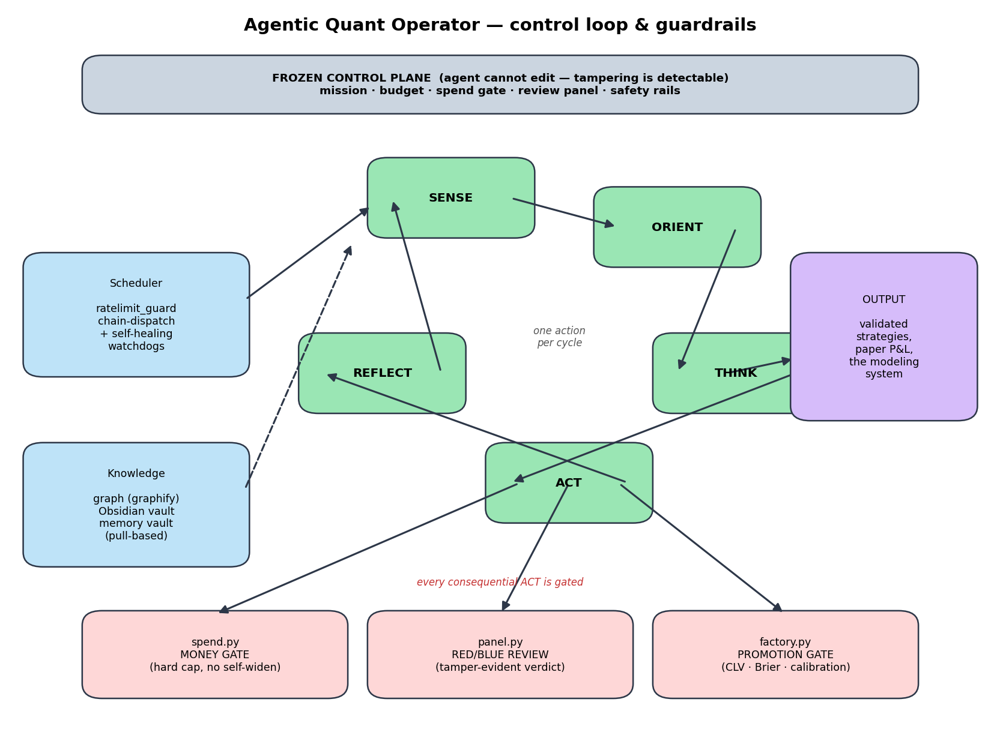

# Agentic Quant Operator

**An autonomous AI engineering agent that runs a quantitative research desk unattended — and the safety architecture that lets it.**

I didn't write a trading system. I engineered the *engineer*: an autonomous agent that runs its own research loop, builds and validates models, paper-trades them, kills its own losing ideas, and reports to a human only at the board level — all inside guardrails it is structurally unable to disable. This repository is the comprehensive documentation of that agent: how it decides, how it's kept safe, how it orchestrates itself across weeks of unattended operation, and how it accumulates knowledge.

### What it built (the one-paragraph version)

Pointed at event-contract and sports-betting markets, the agent produced a full sports-modeling and betting-line-validation system: models that predict match outcomes from team strength alone (never the line), a forward-validation harness (closing-line value, calibration, paper-trading), and a "be the casino" Monte-Carlo study of how a book actually makes money. Its headline honest finding — *the markets are efficient, so you can't beat the line; the edge is in being the house* — is itself a product of the evidence gates described below.

➡️ **The full modeling system, results, and leakage audit live in the companion repo: [casino-line-modeling »](https://github.com/jhunter11/casino-line-modeling).** This repo is the *engineering* half; that one is the *modeling* half. They're two parts of one project.

---

## Contents
1. [Mental model: CEO / board](#1-mental-model-ceo--board)
2. [The work-cycle](#2-the-work-cycle)
3. [Safety architecture](#3-safety-architecture-the-core)
4. [Autonomy & orchestration engine](#4-autonomy--orchestration-engine)
5. [The skills system](#5-the-skills-system-a-staged-business-loop)
6. [Evidence & validation philosophy](#6-evidence--validation-philosophy)
7. [Memory & knowledge](#7-memory--knowledge)
8. [Model orchestration & cost discipline](#8-model-orchestration--cost-discipline)
9. [Engineering skills demonstrated](#9-engineering-skills-demonstrated)
10. [What's excluded, and why](#10-whats-excluded-and-why)

---

## 1. Mental model: CEO / board

The human operator acts as a **board**: sets the mission, funds the sandbox, and approves only board-level decisions (capital, anything legally binding, public actions). The agent acts as a **CEO**: it decides and executes everything operational autonomously and escalates only what genuinely belongs to the board. The entire system is designed around that split — maximal autonomy *inside* hard constraints, with the constraints enforced by code, not by the agent's good intentions.

## 2. The work-cycle

Every scheduled tick runs one disciplined cycle:

```
SENSE  → read runway (burn vs revenue), sandbox balance, recent results,
          data freshness, current strategy stage. (token-budgeted, pull-based)
ORIENT → which stage am I in? planning / validation / delivery / growth
THINK  → what single action most reduces the gap to profit right now?
ACT    → take exactly ONE action. If it risks money, it MUST pass the spend gate first.
REFLECT→ append what was done + learned; surface anything board-level to the operator.
```



The constraint that it takes **one** action per cycle — not a sprawling plan — is deliberate: it keeps each cycle auditable, cheap, and reversible, and it forces the agent to prioritize rather than thrash.

## 3. Safety architecture (the core)

This is the part I'm proudest of. Autonomy is only safe if the agent *cannot* expand its own authority. Four mechanisms enforce that, in code:

### 3.1 Frozen control plane
A defined set of files — mission, budget, the spend gate, the sandbox ledger, the review panel, the safety rails — are **frozen**. The agent may not edit them; to change a limit it must write a proposal for human review. Integrity is checked against a manifest (`harness/freeze.py` / `freeze.json`), so tampering is detectable rather than silent. *The agent cannot rewrite its own guardrails — that's the whole point.*

### 3.2 Money sandbox + spend gate
`harness/spend.py` is **the only path to committing money.** Every spend must call it:
```
python harness/spend.py <amount_usd> "<reason>"   →  APPROVED | DENIED
```
It approves only if `spent_usd + amount <= limit_usd`, records the spend durably against `sandbox.json` (so the running total survives across cycles), and **has no code path that widens the cap.** The agent can spend *down* to the limit and no further; raising the limit is a board action.

### 3.3 Adversarial review panel
Before anything consequential, irreversible, public, or capital-bearing, the agent convenes `harness/panel.py` — a structured **red-team / blue-team review** that returns `VERDICT: PROCEED` or `VERDICT: BLOCKED — <reason>`. Every run writes a **tamper-evident verdict artifact** (`data/reviews/verdict-<ts>-<hash>.json`). A `BLOCKED` verdict must be honored — and the strategy-promotion gate (below) *refuses to promote* anything lacking a valid PROCEED artifact, so the review can't be skipped.

### 3.4 Evidence-gated promotion
No strategy goes live on enthusiasm. `harness/factory.py` / `strategy_gate.py` will only promote a strategy to READY/LIVE when it clears hard, pre-registered gates: positive **forward closing-line value** with clustered-bootstrap significance, **Brier skill vs the market**, calibration error under threshold, and paper P&L beating the market-implied baseline. Plus a `harness/killswitch.py` and explicit `harness/risk.py` exposure limits as backstops.

## 4. Autonomy & orchestration engine

The agent runs for weeks without a human in the inner loop. The machinery that makes that safe and stable:

- **Lane orchestrator** (`orchestrator.py`) — picks the single highest-leverage lane each tick (`pick --json`), executes one bounded action, and records the token spend.
- **Chain dispatcher** (`ratelimit_guard.py`) — a budget-paced launchd dispatcher that sequences ticks so the system respects model rate limits instead of stampeding them.
- **Self-healing** — `cron_preflight.py`, `cron_error_watchdog.py`, `cron_error_sweep.py`, `repair.py`, and `dead_vs_retry.py` detect failed/stalled jobs, auto-disable flapping ones, and triage dead-vs-retry so a single broken job can't silently halt the loop.
- **Concurrency safety** — `editlock.py`, an advisory edit-lock mutex with TTL + reaper, lets multiple agent processes edit shared files without corrupting them.
- **Progress machinery** — `phase.py` auto-advances the project through stages when foundations are complete; `tasks.py` / `sprint.py` manage the task queue.

## 5. The skills system (a staged business loop)

Behavior is organized as composable, token-budgeted **skills** — each a self-contained procedure for one part of the loop:

```
cycle-sense ─▶ stage-router ─▶ ┌ planning-loop   (idea-generation → idea-validation → market-validation → economics-check)
                               ├ validation-loop (validation-test-design → cheapest demand test)
                               ├ delivery-loop   (manual fulfillment before automation)
                               └ growth-loop     (repeatable channel / retention)
                          … then cycle-reflection + strategy-maintenance close the loop.
```

Supporting skills include `review-gate` (decides when the panel is required), `action-execution` (executes exactly one money-gated action), `pain-discovery/evidence/scoring` (validating real demand), `research-governor` and `modeling-deep-dive` (ML rigor), and a `strategy-factory` that advances every candidate one rung per cycle and culls losers.

## 6. Evidence & validation philosophy

The agent is built to *distrust its own results*:

- **Forward metrics, not retro fits** — `metrics.py` computes closing-line value (bps) with clustered-bootstrap significance, Brier skill vs market, and expected calibration error; only *forward* evidence gates promotion.
- **Pre-registration** — `precommittee_backtest.py` and a committee protocol guard against adaptive test-selection / p-hacking.
- **Anti-phantom-edge discipline** — a recurring failure mode (broken settlement logic manufacturing fake edge) is explicitly hunted: settlement base rates are sanity-checked before any "edge" is trusted.
- **Early stopping** — `research_governor.py` logs model iterations and emits deploy/keep/plateau verdicts so research doesn't grind past diminishing returns.
- **Institutional memory of failure** — `friction.py` and `graveyard.py` log every dead idea and friction point, so the agent doesn't re-run searches it already proved empty.

## 7. Memory & knowledge

Context is **pulled, never bulk-read** (token discipline):

- A **knowledge graph** (graphify) answers codebase/architecture questions from a persistent graph instead of re-reading source.
- An **Obsidian vault** (the workspace itself) links strategy/ops notes via wikilinks, with a `CONTEXT_MAP` index and per-note token costs so the agent loads only what it needs.
- A **memory vault** stores atomic, dated lessons; an index lets the agent recall decisions, dead ends, and preferences across sessions.

## 8. Model orchestration & cost discipline

Claude-first, tiered by job: **Opus** for judgment (planning, review, operator-brain), **Sonnet** for specified execution, **Haiku** for routine drafting — with a cross-model fallback for resilience. Every model call is logged; the cheapest model that does the job is preferred. A two-tier "operator-brain (periodic) + execution-ticks (frequent)" design separates expensive deliberation from cheap execution.

## 9. Engineering skills demonstrated

Autonomous-agent architecture · safety/oversight design (capability-bounding, not prompt-trusting) · LLM tool-orchestration · multi-agent concurrency control · self-healing scheduling · evidence-based ML validation (CLV, calibration, bootstrap significance) · pre-registration / anti-overfitting discipline · cost-aware model routing · knowledge-graph + memory systems.

## 10. What's excluded, and why

This is a curated portrait of a live system. Trading credentials, the money-sandbox internals, private market data, and live order paths are **deliberately omitted** — the point is to show the engineering and the safety architecture, not to hand over a running trading bot.

---

*Companion repository — the detailed modeling system this agent designed and validated:*
**[casino-line-modeling »](https://github.com/jhunter11/casino-line-modeling)**
