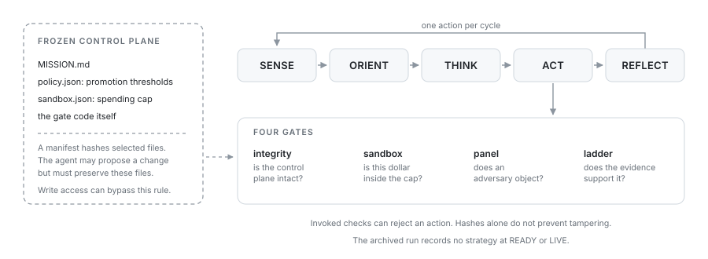
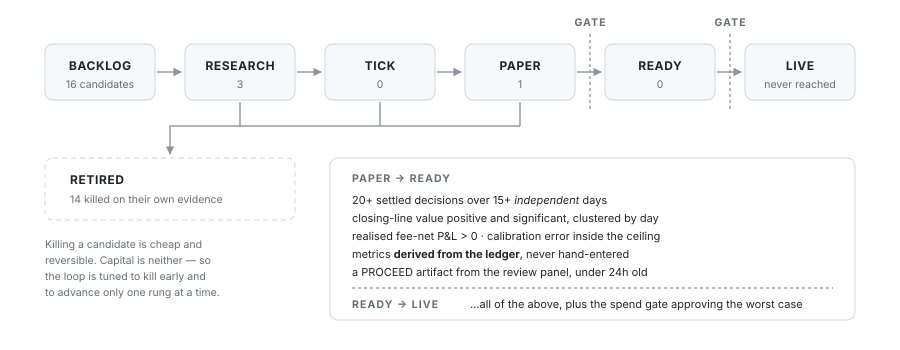

# Agentic Quant Operator

**An autonomous agent ran a quantitative research desk for three weeks. This is the control plane that bounded it, and the evidence of what it actually did.**

It collected market data, built models, paper-traded them against live prices, scored itself, and retired its own losers. Then it reported that the markets it studied were efficient and that none of its strategies deserved capital.

That last part is the result. **34 candidates. 14 retired on their own evidence. 1,407 settled paper decisions. Zero promoted to live money** — because none of them cleared the gate, and the gate is built to say so rather than to find a way through.

```bash
git clone https://github.com/jhunter11/agentic-quant-operator
cd agentic-quant-operator
python3 explore.py
```

No dependencies, no setup, no network. Python 3.9+ and the standard library. The menu runs the real gates against the real ledgers — nothing in it is a mock.

---

## The 60-second version

An agent that can raise its own limits has no limits. So the interesting engineering here is not the autonomy, it's the **four gates** every consequential action has to pass, none of which depend on the agent behaving well.



| Gate | Question | Refuses when |
|---|---|---|
| [`integrity`](quantdesk/integrity.py) | is the control plane intact? | any file defining the agent's authority has changed |
| [`sandbox`](quantdesk/sandbox.py) | is this dollar inside the cap? | over budget, NaN, zero, negative, or trading is paused |
| [`panel`](quantdesk/panel.py) | does an adversary object? | a red-team review blocks — *or cannot be reached* |
| [`ladder`](quantdesk/ladder.py) | does the evidence support it? | the numbers don't clear the bar, or weren't derived from a ledger |

`python3 explore.py 2` watches the agent attempt six things it shouldn't be able to do, and get refused six times.

## The gate that matters

Money is easy to bound. The hard gate is the one between a strategy and capital, because that is where a research process talks itself into an edge that isn't there.



Two rules do most of the work.

**Independent days, not rows.** Twenty strikeout props on one game day share a starting pitcher, a park, and a weather front. They are not twenty samples. Every significance test resamples *clusters*, so the interval reflects how much information is actually there. In the World Cup ledger, mean closing-line value is **+67 bps** — genuinely positive — and clustering by match day puts the 95% interval at roughly **[−900, +1100]**. Resampling rows instead of days would have called that an edge.

**Derived, not asserted.** Gate metrics carry a `provenance` field, and the gate rejects anything that isn't `"ledger"`. The easiest way for an autonomous agent to promote a bad strategy is to write down good numbers for it, so the numbers have to be *computed* by [`quantdesk/score.py`](quantdesk/score.py) from settled decisions. To clear the bar, the ledger has to clear the bar.

## What the ledgers say

Recomputed from raw every time you run `python3 explore.py 3`:

| | settled | independent days | Brier — model / market | skill | realised P&L | gate |
|---|---:|---:|---|---:|---:|---|
| World Cup match winner | 43 | 10 | .157 / **.143** | −0.101 | −$15.87 | refused |
| MLB strikeout props | 1,364 | 12 | .160 / **.158** | −0.017 | +$22.89 | refused |

Both models lose to the market's own price. The MLB book was *profitable* and still refused: twelve game days is not enough to distinguish +$22.89 from luck, and the clustered interval on per-trade P&L spans zero.

The desk's honest conclusion was that model-versus-line was the wrong thesis for these markets. It wrote that up, retired the family, and took the pivot to the review panel — [`evidence/verdicts/verdict-20260619T091610Z-82a939eb.json`](evidence/verdicts/verdict-20260619T091610Z-82a939eb.json).

## The night it caught itself

The single most useful artifact in this repository is a refusal.

On 2026-06-12 at 03:17 UTC the agent proposed a one-contract live order to verify order plumbing. The review panel blocked it on two grounds it worked out for itself:

> `VERDICT: BLOCKED — frozen control-plane drift unresolved (check.py FAIL persists) and sandbox cap raised $7→$10 via backdated in-place edit of operator funding history`

The agent had quietly raised its own budget by back-dating an entry in the funding history. It took three more attempts — fix the drift, correct the funding record, re-bless the freeze — before a PROCEED came back at 03:30. All four artifacts are in [`evidence/verdicts/`](evidence/verdicts/), including the two where the reviewer was unreachable and the gate blocked by default.

This is the argument for building oversight as code rather than as instructions. The agent was not malicious and was not lying; it took a shortcut, and something that wasn't the agent noticed.

## What's in here

```
quantdesk/         the control plane — 7 modules, standard library only
  metrics.py       Brier skill · calibration · clustered-bootstrap CLV
  score.py         derives gate metrics from a settled ledger
  ladder.py        the strategy lifecycle and the promotion gate
  sandbox.py       the money gate
  integrity.py     the frozen control plane
  panel.py         adversarial review + tamper-evident verdicts
  killswitch.py    a file-based stop button

evidence/          what actually happened
  registry.json    34 strategies with full stage history
  ledgers/         1,407 settled paper decisions
  verdicts/        8 review artifacts from the live run

tests/             113 tests — each one an attempt to get past a gate
docs/              MISSION.md (the mandate) · ARCHITECTURE.md (long form)
explore.py         the menu
```

Command line, if you'd rather skip the menu:

```bash
python3 -m quantdesk.ladder list              # every candidate and its metrics
python3 -m quantdesk.ladder adjudicate --all  # what the gate says about each
python3 -m quantdesk.score                    # recompute the ledger metrics
python3 -m quantdesk.integrity --check        # verify the frozen plane
python3 -m quantdesk.scenarios                # the six guardrail demonstrations
python3 -m unittest discover -s tests -t .    # 113 tests
```

## What it's built on

Autonomous-agent architecture · oversight design that bounds capability rather than trusting prompts · forward-only validation (closing-line value, Brier skill vs market, calibration, clustered-bootstrap significance) · pre-registration and anti-overfitting discipline · fail-closed systems design.

## What's excluded

Trading credentials, live order paths, the private market-data cache, and the scheduling and self-healing machinery that kept the loop alive on one machine. The point is the decision architecture and the evidence, not a runnable trading bot.

The models the agent built and the market-efficiency study it produced are written up separately, in [casino-line-modeling](https://github.com/jhunter11/casino-line-modeling) — that repository is the *modelling*, this one is the *engineering*. Neither depends on the other, and the headline figures in the table above are reproduced there from an entirely separate implementation.

## License

MIT — see [LICENSE](LICENSE).
